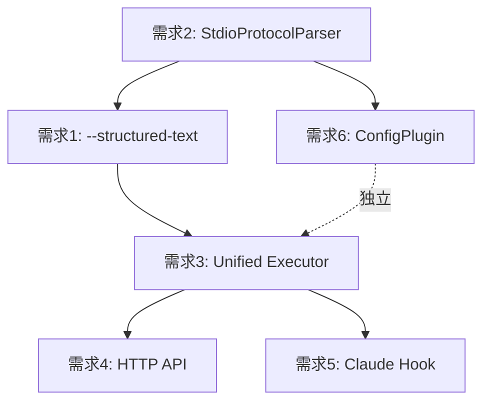

# Memex-CLI 重构路线图

**版本**: 1.0.0
**日期**: 2026-01-10
**状态**: 规划阶段

---

## 目录

1. [需求总览](#1-需求总览)
2. [架构全局视图](#2-架构全局视图)
3. [实施优先级](#3-实施优先级)
4. [详细设计文档](#4-详细设计文档)
5. [依赖关系图](#5-依赖关系图)
6. [风险与缓解](#6-风险与缓解)
7. [时间表](#7-时间表)

---

## 1. 需求总览

### 1.1 六大核心需求

| ID | 需求 | 描述 | 变更规模 | 优先级 |
|----|------|------|---------|--------|
| **需求 1** | 结构化文本参数开关 | `--structured-text` 开关控制输入解析模式 | 中型 (~120 lines) | P1 |
| **需求 2** | 结构化文本解析插件化 | `StdioProtocolParser` trait 实现 | 中型 (~180 lines) | P0 |
| **需求 3** | 统一执行器 | 单/多任务/依赖执行器统一化 | 大型 (~400 lines) | P2 |
| **需求 4** | HTTP 接口扩展 | `/run`, `/resume`, `/replay` 端点 + 流式 | 大型 (~350 lines) | P3 |
| **需求 5** | Claude Code Hook 集成 | Memory 生命周期自动化 | 中型 (~150 lines) | P3 |
| **需求 6** | 配置插件化 | `ConfigPlugin` trait 实现 | 中型 (~130 lines) | P1 |

**总计**: ~1330 lines, 影响 30+ 文件

### 1.2 需求依赖关系

```
需求 2 (P0: 解析插件化)
  ↓
  ├─→ 需求 1 (P1: 参数开关) ← 独立
  └─→ 需求 6 (P1: 配置插件化) ← 独立
        ↓
需求 3 (P2: 统一执行器)
  ↓
  ├─→ 需求 4 (P3: HTTP 接口)
  └─→ 需求 5 (P3: Claude Hook)
```

---

## 2. 架构全局视图

### 2.1 重构前 vs 重构后

#### 重构前架构

```
CLI Layer
  ↓
  ├─ run (单任务) → run_with_query()
  └─ stdio (多任务) → run_stdio()
       ↓
     parse_stdio_tasks() (JSONL only)
```

**问题**:
- 单任务和多任务路径分离
- 输入格式单一（JSONL）
- 配置加载硬编码
- HTTP Server 功能缺失

#### 重构后架构

```
┌──────────────────────────────────────────────────────────┐
│                     CLI Layer                            │
│  (--structured-text, --prompt, --stdin)                  │
└──────────────────────────────────────────────────────────┘
                          ↓
┌──────────────────────────────────────────────────────────┐
│                  Input Parsing Layer                     │
│  InputParser::parse(input, structured, ...)              │
│    ├─ Structured: StdioProtocolParser trait             │
│    │    └─ StandardStdioParser (---TASK--- format)      │
│    └─ Plain Text: wrap_as_plain_text_task()             │
└──────────────────────────────────────────────────────────┘
                          ↓
                  Vec<StdioTask>
                          ↓
┌──────────────────────────────────────────────────────────┐
│                 Unified Executor Layer                   │
│  execute_tasks(tasks, ctx, opts)                         │
│    ├─ Single Task → run_with_query()                    │
│    └─ Multi Tasks → TaskGraph + DAG Scheduler           │
│         ├─ Dependency Resolution                        │
│         ├─ Topological Sort                             │
│         └─ Parallel Execution                           │
└──────────────────────────────────────────────────────────┘
                          ↓
                ┌─────────┴─────────┐
                ↓                   ↓
┌──────────────────────┐  ┌──────────────────────┐
│   Engine Layer       │  │   HTTP Server        │
│  - Memory Inject     │  │  - POST /run         │
│  - Gatekeeper        │  │  - POST /resume      │
│  - Events Out        │  │  - POST /replay      │
└──────────────────────┘  │  - SSE Streaming     │
                          └──────────────────────┘
                                    ↓
                          Claude Code Hooks
                            (SessionStart/End)
```

### 2.2 新增模块概览

```
core/src/
├── input/                      (新增) 输入解析
│   ├── mod.rs
│   ├── parser.rs               # InputParser
│   └── plain_text.rs
├── stdio/
│   ├── protocol.rs             (新增) # StdioProtocolParser trait
│   └── parsers/                (新增)
│       ├── mod.rs
│       └── standard.rs         # StandardStdioParser
├── executor/                   (新增) 统一执行器
│   ├── mod.rs
│   ├── types.rs                # UnifiedTask, TaskGraph
│   ├── engine.rs               # 执行引擎
│   └── graph.rs                # DAG 拓扑排序
├── config/
│   ├── plugin.rs               (新增) # ConfigPlugin trait
│   └── loader.rs               (新增) # ConfigLoader
└── claude/                     (新增) Claude Code 集成
    └── transcript.rs           # Transcript 解析器

plugins/src/
├── input/                      (新增) 解析器实现
├── config/                     (新增) 配置插件
│   ├── env_var.rs
│   └── file.rs
└── http_server/                (扩展)
    ├── routes/
    │   ├── run.rs
    │   ├── resume.rs
    │   └── replay.rs
    └── state.rs                # 多会话状态管理
```

---

## 3. 实施优先级

### 3.1 阶段划分

#### Phase 1: 基础设施 (P0 + P1, 4-7 天)

**目标**: 建立插件化基础，支持灵活的输入和配置

| 任务 | 需求 | 工作量 | 输出 |
|------|------|--------|------|
| StdioProtocolParser trait | 需求 2 | 1 天 | trait 定义 + StandardStdioParser |
| InputParser 实现 | 需求 1 | 1 天 | 结构化 vs 普通文本解析 |
| ConfigPlugin trait | 需求 6 | 1-2 天 | trait + EnvVarPlugin + FilePlugin |
| 单元测试 | 全部 | 1 天 | 90%+ 覆盖率 |

**里程碑**:
- ✅ `--structured-text` 参数可用
- ✅ 可插拔配置加载器
- ✅ 向后兼容现有命令

#### Phase 2: 执行器重构 (P2, 3-4 天)

**目标**: 统一单任务和多任务执行路径

| 任务 | 需求 | 工作量 | 输出 |
|------|------|--------|------|
| TaskGraph + DAG | 需求 3 | 1.5 天 | 依赖解析 + 拓扑排序 |
| Executor Engine | 需求 3 | 1.5 天 | 并行调度 + 重试机制 |
| 集成测试 | 需求 3 | 1 天 | 复杂场景验证 |

**里程碑**:
- ✅ 支持多任务依赖关系
- ✅ 自动并行执行
- ✅ 循环依赖检测

#### Phase 3: 对外接口 (P3, 3-5 天)

**目标**: 扩展 HTTP API 和外部集成

| 任务 | 需求 | 工作量 | 输出 |
|------|------|--------|------|
| HTTP 端点实现 | 需求 4 | 2 天 | `/run`, `/resume`, `/replay` |
| SSE 流式输出 | 需求 4 | 1 天 | Server-Sent Events |
| Claude Hook 集成 | 需求 5 | 1-2 天 | Transcript 解析 + Memory 写入 |
| 文档 + 示例 | 全部 | 1 天 | API 文档 + 使用指南 |

**里程碑**:
- ✅ HTTP API 可用
- ✅ Claude Code 自动记忆
- ✅ 完整文档发布

### 3.2 实施顺序理由

**为什么 P0/P1 优先**:
- 解析和配置是基础能力，后续功能依赖
- 风险小，易测试
- 可独立发布，快速验证

**为什么 P2 其次**:
- 执行器重构影响面大，需充分测试
- 阻塞 HTTP API 和 Hook 集成
- 需要稳定的输入解析

**为什么 P3 最后**:
- 依赖前置功能稳定
- 可增量发布
- 外部集成需要 beta 测试期

---

## 4. 详细设计文档

### 4.1 需求 1 & 2: 结构化文本输入

**文档**: [STRUCTURED_TEXT_DESIGN.md](./STRUCTURED_TEXT_DESIGN.md)

**核心内容**:
- `--structured-text` 参数设计
- `StdioProtocolParser` trait 定义
- `InputParser` 实现
- 格式验证和错误提示

**关键决策**:
- 默认启用结构化解析（向多任务能力倾斜）
- 不自动回退（明确报错，避免混淆）
- 普通文本自动包装为单任务

### 4.2 需求 3: 统一执行器

**文档**: [EXECUTOR_DESIGN.md](./EXECUTOR_DESIGN.md) (待创建)

**核心内容**:
- `TaskGraph` 数据结构
- DAG 拓扑排序算法
- 并行调度策略
- 重试和超时机制

**关键决策**:
- 使用 Kahn 算法进行拓扑排序
- tokio::JoinSet 实现并行执行
- 阶段化执行（stage-by-stage）
- 支持 text 和 jsonl 双输出格式

### 4.3 需求 4: HTTP 接口扩展

**文档**: [HTTP_API_DESIGN.md](./HTTP_API_DESIGN.md) (待创建)

**核心内容**:
- RESTful API 设计
- Server-Sent Events 实现
- 多会话状态管理
- 错误处理和重试

**关键决策**:
- 使用 Axum 框架
- SSE 实现流式输出
- 独立 AppState 管理多 run_id
- 兼容 CLI 语义

### 4.4 需求 5: Claude Code Hook

**文档**: [CLAUDE_INTEGRATION.md](./CLAUDE_INTEGRATION.md) (待创建)

**核心内容**:
- Hook 触发点设计
- Transcript 解析逻辑
- Memory 生命周期自动化
- 配置示例

**关键决策**:
- Bash 脚本实现 Hook
- 复用 `record-session` 命令
- 自动 Gatekeeper 评估
- 可选择性启用

### 4.5 需求 6: 配置插件化

**文档**: [CONFIG_PLUGIN_DESIGN.md](./CONFIG_PLUGIN_DESIGN.md) (待创建)

**核心内容**:
- `ConfigPlugin` trait 定义
- 配置合并策略
- 优先级机制
- 内置插件实现

**关键决策**:
- 插件按优先级排序
- 高优先级覆盖低优先级
- 支持环境变量、文件、远程配置
- 向后兼容现有加载逻辑

---

## 5. 依赖关系图

### 5.1 模块依赖



### 5.2 文件依赖

```
core/src/stdio/protocol.rs (需求2)
  ↓
core/src/stdio/parsers/standard.rs (需求2)
  ↓
core/src/input/parser.rs (需求1)
  ↓
cli/src/commands/cli.rs (需求1)
  ↓
cli/src/app.rs (需求1)
  ↓
core/src/executor/types.rs (需求3)
  ↓
core/src/executor/engine.rs (需求3)
  ↓
  ├─→ plugins/src/http_server/routes/run.rs (需求4)
  └─→ cli/src/commands/memory.rs (需求5)

core/src/config/plugin.rs (需求6, 独立)
```

---

## 6. 风险与缓解

### 6.1 技术风险

| 风险 | 概率 | 影响 | 缓解措施 |
|------|------|------|---------|
| **Breaking Changes** | 中 | 高 | Feature flags + 向后兼容测试 |
| **循环依赖检测 Bug** | 中 | 高 | Fuzz testing + 单元测试 |
| **性能回退** | 低 | 中 | Benchmark 基线 + 优化热路径 |
| **HTTP SSE 连接泄漏** | 中 | 中 | 连接池 + 超时 + 监控 |
| **并发竞争条件** | 低 | 高 | 使用 Arc/Mutex + 严格测试 |

### 6.2 项目风险

| 风险 | 概率 | 影响 | 缓解措施 |
|------|------|------|---------|
| **时间超支** | 中 | 中 | 分阶段发布，P3 可推迟 |
| **用户混淆** | 中 | 中 | 完善文档 + 清晰错误提示 |
| **测试覆盖不足** | 低 | 高 | 代码审查 + CI 强制覆盖率 |
| **依赖冲突** | 低 | 低 | 锁定依赖版本 + Cargo.lock |

### 6.3 缓解策略详解

#### 向后兼容性保证

**策略**:
1. 所有新参数提供默认值
2. 现有命令行为完全不变
3. 添加集成测试覆盖旧用法
4. Feature flags 控制新功能

**验证**:
```bash
# 回归测试套件
./scripts/test_backward_compatibility.sh
# 检查点:
# - 现有 run 命令无参数变化
# - stdio 命令行为不变
# - 配置文件格式兼容
```

#### 性能监控

**Benchmark 基线**:
```rust
// benches/executor.rs
#[bench]
fn bench_parse_100_tasks(b: &mut Bencher) {
    // 目标: < 10ms
}

#[bench]
fn bench_dag_sort_50_tasks(b: &mut Bencher) {
    // 目标: < 5ms
}

#[bench]
fn bench_execute_10_parallel_tasks(b: &mut Bencher) {
    // 目标: < 500ms (模拟执行)
}
```

---

## 7. 时间表

### 7.1 甘特图

```
Week 1: Phase 1 (基础设施)
├─ Day 1-2: 需求 2 (StdioProtocolParser)
├─ Day 3-4: 需求 1 (--structured-text)
└─ Day 5-7: 需求 6 (ConfigPlugin)

Week 2: Phase 2 (执行器重构)
├─ Day 8-10: 需求 3 (TaskGraph + Engine)
└─ Day 11-12: 集成测试 + 文档

Week 3: Phase 3 (对外接口)
├─ Day 13-15: 需求 4 (HTTP API)
├─ Day 16-17: 需求 5 (Claude Hook)
└─ Day 18-19: 文档 + Beta 测试

Week 4: 发布准备
├─ Day 20-21: Bug 修复 + 优化
└─ Day 22: 发布 v0.2.0
```

### 7.2 里程碑

| 里程碑 | 日期 | 交付物 |
|--------|------|--------|
| **M1: 基础设施完成** | Week 1 结束 | 需求 1, 2, 6 完成 + 测试 |
| **M2: 执行器稳定** | Week 2 结束 | 需求 3 完成 + 集成测试 |
| **M3: 功能完整** | Week 3 结束 | 需求 4, 5 完成 + 文档 |
| **M4: 正式发布** | Week 4 结束 | v0.2.0 + Release Notes |

### 7.3 发布策略

**v0.2.0-alpha.1** (Week 1 结束):
- 需求 1, 2, 6 可用
- 标记为 experimental
- 内部测试

**v0.2.0-beta.1** (Week 2 结束):
- 需求 1, 2, 3, 6 可用
- 公开 beta 测试
- 收集反馈

**v0.2.0** (Week 4 结束):
- 所有需求完成
- 稳定性验证
- 正式发布

---

## 8. 文件清单

### 8.1 新增文件

**核心模块** (core/src/):
- `input/mod.rs`
- `input/parser.rs`
- `input/plain_text.rs`
- `stdio/protocol.rs`
- `stdio/parsers/mod.rs`
- `stdio/parsers/standard.rs`
- `executor/mod.rs`
- `executor/types.rs`
- `executor/engine.rs`
- `executor/graph.rs`
- `config/plugin.rs`
- `config/loader.rs`
- `claude/mod.rs`
- `claude/transcript.rs`

**插件模块** (plugins/src/):
- `input/mod.rs` (预留)
- `config/mod.rs`
- `config/env_var.rs`
- `config/file.rs`
- `http_server/routes/run.rs`
- `http_server/routes/resume.rs`
- `http_server/routes/replay.rs`
- `http_server/state.rs`

**测试** (tests/):
- `integration/structured_text.rs`
- `integration/executor.rs`
- `integration/http_api.rs`

**文档** (docs/):
- `STRUCTURED_TEXT_DESIGN.md` ✅
- `REFACTORING_ROADMAP.md` (本文档)
- `EXECUTOR_DESIGN.md` (待创建)
- `HTTP_API_DESIGN.md` (待创建)
- `CLAUDE_INTEGRATION.md` (待创建)
- `CONFIG_PLUGIN_DESIGN.md` (待创建)

**总计**: 30+ 新增文件

### 8.2 修改文件

**CLI**:
- `cli/src/commands/cli.rs` (RunArgs, StdioArgs)
- `cli/src/app.rs` (run_command, stdio_command)
- `cli/src/commands/memory.rs` (record_session 增强)

**Core**:
- `core/src/api.rs` (导出新 API)
- `core/src/lib.rs` (注册新模块)
- `core/src/config/load.rs` (集成 ConfigLoader)

**配置**:
- `Cargo.toml` (添加依赖: rand, regex, axum, tokio-stream)

**总计**: 7 修改文件

---

## 9. 验收标准

### 9.1 功能验收

- [ ] 需求 1: `--structured-text` 参数可用，支持开关切换
- [ ] 需求 2: StandardStdioParser 通过所有格式测试
- [ ] 需求 3: 支持 DAG 依赖调度，循环检测正常
- [ ] 需求 4: HTTP API 可用，SSE 流式正常
- [ ] 需求 5: Claude Hook 自动记忆，Gatekeeper 正常触发
- [ ] 需求 6: ConfigPlugin 按优先级合并配置

### 9.2 质量验收

- [ ] 单元测试覆盖率 ≥ 90%
- [ ] 集成测试覆盖主要场景
- [ ] 性能无明显回退（± 5%）
- [ ] 向后兼容性验证通过
- [ ] 文档完整且准确

### 9.3 发布验收

- [ ] Release Notes 完整
- [ ] 迁移指南清晰
- [ ] 示例代码可运行
- [ ] CI/CD 流程通过
- [ ] Code Review 完成

---

## 10. 后续规划

### 10.1 v0.3.0 规划

**可能的增强功能**:
1. WebSocket 支持（实时双向通信）
2. YAML/TOML 格式的 STDIO 变体
3. 任务优先级调度
4. 资源限制和配额管理
5. 分布式执行支持

### 10.2 长期愿景

**Memex-CLI 生态**:
- Plugin Marketplace（社区插件）
- GUI Dashboard（可视化任务管理）
- Cloud Integration（云端 Memory 同步）
- Team Collaboration（多人协作）

---

**文档版本**: v1.0.0
**最后更新**: 2026-01-10
**作者**: Architecture Design Task
**审阅者**: TBD
**批准者**: TBD

**相关文档**:
- [STRUCTURED_TEXT_DESIGN.md](./STRUCTURED_TEXT_DESIGN.md) - 需求 1 & 2 详细设计
- [STDIO_PROTOCOL.md](./STDIO_PROTOCOL.md) - STDIO 协议规范
- [ARCHITECTURE_ANALYSIS.md](./ARCHITECTURE_ANALYSIS.md) - 当前架构分析
